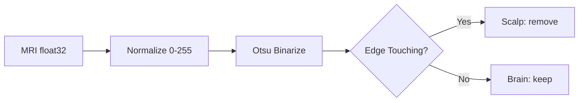
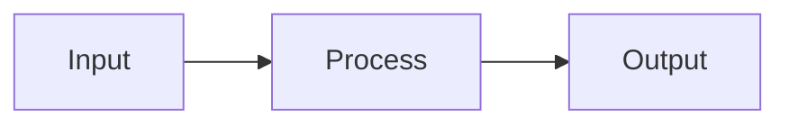

# 프로젝트/엔지니어링 글 작성 가이드

모델 구축·실험·시스템 구축류 글을 위한 콘텐츠 구조·스타일 가이드입니다. 대상 글 유형:

- **모델/실험**: 예) [ESM2 변이 분류](../../_posts/2025-11-30-protein-variant-classification-esm2.md), [MRI skull mask 생성](../../_posts/2025-12-29-skull-mask-generation-mri.md)
- **시스템 구축**: 예) [FastAPI CI/CD 파이프라인](../../_posts/2025-11-25-cicd-pipeline-fastapi.md), [HTTPS CI/CD](../../_posts/2025-12-02-secure-https-cicd-fastapi.md)

> **언어 정책**: 모든 **블로그 글(`_posts/*.md`)은 영어**로 씁니다. 이 가이드처럼 저자용 문서(`docs/guide`, `docs/blog_post`)만 한국어입니다. 아래 템플릿·예시 본문은 그대로 복붙할 수 있도록 영어로 제공합니다.

> 파일명·front matter 필드 의미·이미지 경로 규칙 등 **공통 규칙은 [03. 글 작성 규칙](../guide/03-writing-posts.md)에 정의**되어 있으니 여기서 반복하지 않습니다. 이 문서는 **프로젝트/엔지니어링 글의 콘텐츠 구조와 글 유형별 스타일**, 그리고 **게시 후 검증 체크리스트**에 집중합니다.

## 섹션 구조(H2)

본문 헤더는 항상 `## `(H2)부터 시작합니다. 단일 `#`는 쓰지 않습니다(파일 맨 위 `---` front matter의 `title`이 사실상 H1 역할). 권장 골격:

| 순서 | 섹션(H2) | 역할 | 비고 |
| --- | --- | --- | --- |
| 1 | `## Introduction` | 문제·목표·맥락을 2~4문장으로 | 무엇을, 왜, 어떤 제약(데이터 5장 등) 아래 했는지 |
| 2~N | Challenge / Problem별 섹션 | 설계 결정 → 코드 → 표/지표 → 교훈 | 글 본체. 아래 두 패턴 중 택1 |
| N+1 | `## Results` | 최종 수치·산출물·스크린샷 | 본문에서 언급한 지표를 한자리에 모음 |
| N+2 | `## What Didn't Work / Limitations` *(권장)* | 실패한 시도·한계·안 테스트한 것 | NeurIPS는 Limitations 섹션을 명시 요구; Huyen식 ML 시스템 글은 setup/data/modeling/serving의 trade-off를 드러내기 좋음. skull-mask "Development Journey"가 좋은 예 |
| 끝 | `## Conclusion` (+ `## Resources`) | 핵심 교훈 3개 내외 + 한 줄. **`## Resources`에 코드/프로젝트 repo 링크 권장** | 외부 링크·repo |

**Challenge/Problem 섹션 두 패턴** — 글 성격에 맞춰 일관되게 하나만 씁니다:

- **모델/실험류** → `## Challenge N: <설계 과제>` (ESM2 글: Metric Selection → Modeling → Class Imbalance → Distributed Training). 각 챌린지는 "왜 어려운가 → 어떻게 풀었나 → 결과/교훈" 흐름.
- **시스템/트러블슈팅류** → `## Problem N: <증상 한 줄>` + 하위 `### Symptom` / `### Root Cause` / `### Solution` / **`**Lesson:**`**. (CI/CD 글이 이 구조를 5개 Problem에 일관 적용.)

> skull-mask 글처럼 **파이프라인 단계가 핵심**이면 `## Step 1: Normalization` … `## Step N` 으로 단계를 H2로 쪼개고, 각 단계에 `### Why` / `### How It Works` 하위 헤더를 둡니다. 단계마다 입력→출력을 한 줄로 적으면 스킴 읽기 좋습니다(`**Before**: [1.8e-07, 3.5e-05]` → `**After**: [0, 255]`).

## 다이어그램: mermaid vs 외부 이미지

front matter에 `mermaid: true`를 넣고 ```` ```mermaid ```` 블록을 씁니다. 아키텍처·파이프라인 흐름은 **mermaid를 우선**합니다(텍스트로 버전 관리되고 수정이 쉬움). skull-mask 글의 `flowchart LR` 예시처럼 단계와 분기(`{Edge Touching?}`)를 그대로 표현할 수 있습니다.



외부 렌더 이미지(`assets/img/posts/<topic>/...`)는 다음 경우에만 씁니다:

- 실제 산출물 스크린샷(Swagger UI, 추론 결과 오버레이 등) — CI/CD 글의 `swagger_ui_final_*.png`
- mermaid로 표현하기 어려운 모델 구조도 — ESM2 글의 `architecture.png`, `baseline_architecture.png`

> **이미지 경로 규칙(요약, 상세는 [03 문서](../guide/03-writing-posts.md#이미지-경로-규칙))**: front matter `image.path`는 **맨 앞 `/` 없이**(`assets/img/posts/<topic>/cover.png`), **본문 인라인 이미지는 맨 앞 `/`를 붙여서**(``) 씁니다(여기 `<topic>`·`<filename>`은 placeholder). 토픽 폴더(`<topic>`)는 글 슬러그와 맞춥니다.

## 코드 스니펫: 자체완결되게

코드 블록은 **그것만 복사해 실행해도 NameError가 안 나도록** import를 포함합니다. 독자는 보통 한 블록만 떼어 갑니다.

> **교훈(ESM2 글 사례)**: Top-K Recall 평가 스니펫이 `pd.DataFrame`/`groupby`를 쓰는데 `import pandas as pd`가 빠지면 그 블록만으로는 `NameError: name 'pd' is not defined`가 납니다. 한 셀에서 쓰는 외부 심볼(`np`, `pd`, `torch`, `cv2`, `roc_auc_score` 등)은 같은 블록 상단에 모두 import합니다.

좋은 예 — 이 블록만 떼어도 돈다:

```python
import pandas as pd

def compute_top_k_recall(df: pd.DataFrame, score_col: str, k: int) -> float:
    """Compute Top-K Recall per patient."""
    hits = 0
    for patient_id, group in df.groupby("Patient_ID"):
        sorted_group = group.sort_values(score_col, ascending=False)
        if 1 in sorted_group.head(k)["LABEL"].values:
            hits += 1
        # end if
    # end for
    return hits / df["Patient_ID"].nunique()
# end def
```

추가 규칙:

- **하우스 스타일 블록 종료 마커**: Python 코드의 함수/반복/조건 끝에 `# end def` / `# end for` / `# end if`(필요 시 `# end with`)를 답니다. 위 예시·skull-mask·ESM2 글 모두 이 관례를 따릅니다.
- 짧은 모델 정의(`nn.Module`)나 설정 스니펫(class weight 한 줄 등)은 import를 생략해도 되지만, **import가 없으면 "어떤 라이브러리인지" 한 줄로 본문에 적어** 둡니다(`I used PyTorch's DistributedDataParallel (DDP)`).
- 셸 명령은 ```` ```bash ````, YAML/설정은 ```` ```yaml ````, 에러 로그·다이어그램 ASCII는 ```` ```text ```` 또는 라벨 없는 펜스로 구분합니다.

## 수식 표기: 일관되게

**수식을 쓰는 글은** front matter에 `math: true`를 넣고 인라인 `$...$`, 블록 `$$...$$`를 씁니다. **하나의 지표는 글 전체에서 같은 표기**를 유지합니다.

> **교훈(skull-mask 글 사례)**: 같은 IoU를 정의식($\frac{|P \cap G|}{|P \cup G|}$)·표·결과 문장에서 표기와 자리수가 어긋나지 않게 합니다. 예를 들어 표는 `0.9794`인데 초안 단계에서 intro에 `0.9795`로 적힌 적이 있는 식의 **소수 자릿수 불일치**는 흔히 생기는 대표적 위험입니다(현재 글은 모두 `0.9794`로 통일되어 있습니다; 아래 [지표 상호 일관성](#지표수치-상호-일관성) 참고). 약어도 글마다 한 번 풀어 줍니다 — `IoU (Intersection over Union)`, `Dice`처럼 첫 등장 시 정의.

표준 표기 예(이 두 식은 모든 segmentation 글에서 동일하게 씀):

$$
\text{IoU} = \frac{|P \cap G|}{|P \cup G|}, \qquad
\text{Dice} = \frac{2\,|P \cap G|}{|P| + |G|}
$$

- 분류 지표도 첫 등장 시 정의식을 표로 제시: Recall $\frac{TP}{TP+FN}$, Precision $\frac{TP}{TP+FP}$, F1 $\frac{2 \cdot P \cdot R}{P + R}$ (ESM2 글 참고).
- 같은 식 안에서 기호를 섞지 않습니다($P$로 Precision도 쓰고 Predicted도 쓰면 충돌 — 문맥이 겹치면 한쪽을 풀어 씀).

## 지표/수치 상호 일관성

본문 여러 곳에 흩어진 수치는 **서로 모순되지 않아야** 합니다. 게시 전에 직접 산수로 확인합니다.

**처리시간 교차검증 예(skull-mask 글, 일관성 OK)** — ms ↔ images/sec ↔ 총시간이 서로 맞는지:

| 항목 | 글의 값 | 검산 | 결과 |
| --- | --- | --- | --- |
| 장당 처리시간 | 16.6 ms | — | 기준값 |
| 초당 처리량 | 60.2 images/sec | `1000 / 16.6 = 60.2` | 일치 |
| 10만 장(1스레드) | ~28분 | `100000 × 16.6ms = 1,660,000ms ≈ 27.7분` | 일치 |
| 10만 장(8코어) | ~4분 | `27.7 / 8 ≈ 3.5분` | 일치(반올림) |

**대표적 불일치 위험(skull-mask 글 예시)**: 초안 단계에서 Introduction에 `IoU 0.9795`로 적힌 적이 있었지만, dilation 튜닝 표와 "Understanding the Metrics" 결과 문장은 모두 `0.9794`(26px 최적값)였습니다(현재 글은 intro·표·결론 모두 `0.9794`로 통일). **요약(intro)·표·결론에 같은 수치가 세 번 나오면 셋을 같은 값으로** 맞춥니다.

체크 포인트:

- AUROC/F1/Recall처럼 **표에 굵게 표시한 "best"가 본문 결론과 같은지**(ESM2: Predictor B가 표에서도 본문에서도 best).
- 단위 환산(ms ↔ /sec ↔ min, MB ↔ GB, build+deploy 합이 "총 N분"과 맞는지 — CI/CD 글: build 2~3분 + deploy ~30초 → "under 4 minutes").
- 데이터셋 규모(예: `107 patients`, `5 labeled images`, `(5, 768, 624)`)를 Introduction/Data 섹션과 코드·표에서 동일하게.

## 재현성: 코드 링크 · 환경 · 시드

존경받는 엔지니어링/ML 글의 거의 **보편적 관행**은 재현 수단을 함께 제공하는 것입니다.

- **코드/프로젝트 repo 링크** *(공개 시 최우선)*: 결과를 낸 코드·노트북·repo를 본문이나 `## Resources`에 링크합니다. [Distill](https://distill.pub/2018/editorial-update/)은 글마다 repo/이슈로 출판하고, [Papers With Code](https://github.com/paperswithcode/releasing-research-code)·Sebastian Raschka([rasbt/LLMs-from-scratch](https://github.com/rasbt/LLMs-from-scratch), 96k+★ · 2026-06 기준)가 코드 동반을 표준으로 보여줍니다. 단, **공개 repo가 없으면(비공개 과제·사내 코드)** 무리해서 링크하지 말고 — 없는 링크를 지어내지 말 것 — 대신 본문에 **스택·버전·핵심 스니펫**으로 재현 단서를 충분히 남깁니다(이 블로그의 ESM2·skull-mask 글이 이 방식).
- **실험형 글의 환경 정보** *(모델/실험류에 한함)*: 하드웨어(GPU 종류·개수), 프레임워크 + **버전**(예: PyTorch 2.1, CUDA 12.3), 데이터셋 규모, 그리고 결과가 시드에 민감하면 **random seed**를 적습니다. 출처별 강조점이 다릅니다 — **컴퓨트·하드웨어**는 [NeurIPS 체크리스트](https://neurips.cc/public/guides/PaperChecklist)(Q8 compute resources), **의존성·학습·평가·결과 재현 커맨드**는 [Papers With Code 코드 완전성 체크리스트](https://github.com/paperswithcode/releasing-research-code), **시드와 비결정성(완전 재현 불가) 한계**는 [PyTorch 재현성 노트](https://docs.pytorch.org/docs/stable/notes/randomness.html)가 다룹니다.
- **시스템/explainer류**(CI/CD, 설명 위주)에는 시드·하드웨어가 불필요합니다 — 이 규칙은 **실험 지표를 보고하는 글에만** 적용하세요.

> 완전한 재현은 PyTorch 공식 노트 기준으로도 릴리스·플랫폼·CPU/GPU에 따라 보장되지 않습니다. 목표는 "**이 환경에서 이 수치가 나왔다**"를 명시하는 것입니다.

## front matter 예시

`categories`는 `[대분류, 소분류]` 2단계. 프로젝트/엔지니어링 글의 대분류는 보통 `AI` 또는 `DevOps`입니다(소분류 예: `Bioinformatics`, `Medical Imaging`, `CI/CD`). **수식이 있으면 `math: true`**(모델/실험 글은 수식이 들어갈 가능성이 높으니 필요 여부를 확인), 아키텍처·파이프라인 다이어그램이 있으면 `mermaid: true`.

| 글 | categories | math | mermaid |
| --- | --- | --- | --- |
| ESM2 변이 분류 | `[AI, Bioinformatics]` | true | (불필요) |
| MRI skull mask | `[AI, Medical Imaging]` | true | true |
| FastAPI CI/CD | `[DevOps, CI/CD]` | true | (이미지로 대체) |

## 복붙 템플릿(영어 본문)

아래를 `_posts/YYYY-MM-DD-<slug>.md`로 복사해 사용합니다. 본문은 영어, `<topic>`는 슬러그와 맞춥니다.

````markdown
---
title: "Building <X> with <Method/Stack>"
date: 2026-01-15 00:00:00 +0900
categories: [AI, Medical Imaging]
tags: [tag1, tag2, tag3]
description: "One-sentence summary with the headline result (e.g., IoU 0.98 with 5 labeled images)."
author: seoultech
image:
  path: assets/img/posts/<topic>/cover.png
  alt: <Descriptive alt text>
# math: true     # uncomment only if the post has equations
# mermaid: true  # uncomment only if the post has diagrams
---

## Introduction

What problem, why it matters, and the key constraint (e.g., only 5 labeled images).
State the goal in one sentence and the headline result up front.

## Challenge 1: <Design Decision>

Why this is hard. The trade-off you faced.

```python
import numpy as np

def example(x: np.ndarray) -> float:
    # ... self-contained: import everything this block uses
    return float(x.mean())
# end def
```

| Metric | Formula | Why it matters |
|--------|---------|----------------|
| Recall | $\frac{TP}{TP+FN}$ | Cannot miss positives |

**Lesson:** One concrete takeaway from this challenge.

## Challenge 2: <Design Decision>



Explain the design and show the deciding metric/table.

## Results

| Setting | IoU | Dice | Time/img |
|---------|-----|------|----------|
| Final   | 0.98 | 0.99 | 16.6 ms |

Make sure every number here matches what you stated earlier
(ms ↔ images/sec ↔ total time, best-row ↔ conclusion).
<!-- Experiment posts: also state hardware/GPU, framework + version, dataset size, and seed if a result depends on it. -->

## What Didn't Work / Limitations

- <An approach you tried that failed, and why.>
- <A limitation of the final result; what you did not test.>

## Conclusion

1. Key insight one.
2. Key insight two.
3. Key insight three.

One closing sentence.

## Resources

- **Code**: [project repository](https://github.com/<you>/<repo>)
- <Paper / dataset / docs links, if any>
````

## 게시 후 검증 체크리스트

게시(또는 PR) 직전에 확인합니다. 빌드·링크 검사는 `bash tools/run.sh` / `bash tools/test.sh`로([02 문서](../guide/02-getting-started.md) 참고).

- [ ] **언어**: 본문이 영어인가(이 가이드 외 `_posts/*.md`는 영어).
- [ ] **헤더 레벨**: 본문 헤더가 `## `(H2)부터 시작하고 단일 `#`가 없는가.
- [ ] **front matter**: `title`·`date`·`categories`·`tags` 존재; 수식 있으면 `math: true`, mermaid 있으면 `mermaid: true`.
- [ ] **이미지 경로**: `image.path`는 `/` 없이, 본문 인라인 이미지는 `/assets/...`로 시작; `assets/img/posts/<topic>/`에 파일 실제 존재.
- [ ] **코드 자체완결성**: 각 코드 블록이 import 포함해 단독 실행 가능한가(`pd`/`np`/`torch` 누락 없음).
- [ ] **블록 종료 마커**: Python 함수/반복/조건에 `# end def`·`# end for`·`# end if`.
- [ ] **수식 표기 일관성**: 한 지표가 정의식·표·본문에서 같은 표기/약어/자릿수인가.
- [ ] **지표 상호 일관성**: intro 요약 ↔ 표 ↔ Results ↔ Conclusion의 수치가 서로 일치(소수 자릿수 포함); 단위 환산(ms↔/sec↔min) 검산 통과.
- [ ] **best 표기 일관성**: 표에서 굵게 한 "best" 행이 본문 결론과 같은가.
- [ ] **코드/프로젝트 링크**: 공개 repo가 있으면 본문·`## Resources`에 링크했는가(비공개 과제면 스택·버전·핵심 스니펫으로 재현 단서를 남겼는가).
- [ ] **재현성(실험형 한정)**: 하드웨어/GPU·프레임워크 버전·데이터셋 규모(시드 민감하면 seed)에 더해, [PwC 체크리스트](https://github.com/paperswithcode/releasing-research-code) 기준 **의존성(requirements/env)·학습/평가 재현 커맨드·결과 표를 재현하는 커맨드**(공개 가능하면 commit/tag)를 적었는가.
- [ ] **한계/실패**: 안 된 시도·한계를 정직하게 적었는가(요약만으로 끝나지 않음).
- [ ] **다이어그램 렌더**: mermaid 블록이 실제로 렌더되는가(문법 오류 시 [troubleshooting-mermaid-diagram-syntax](../../_posts/2025-12-24-troubleshooting-mermaid-diagram-syntax.md) 참고).
- [ ] **빌드/링크**: `tools/run.sh` 미리보기 정상, `tools/test.sh`(html-proofer) 링크 깨짐 없음.
