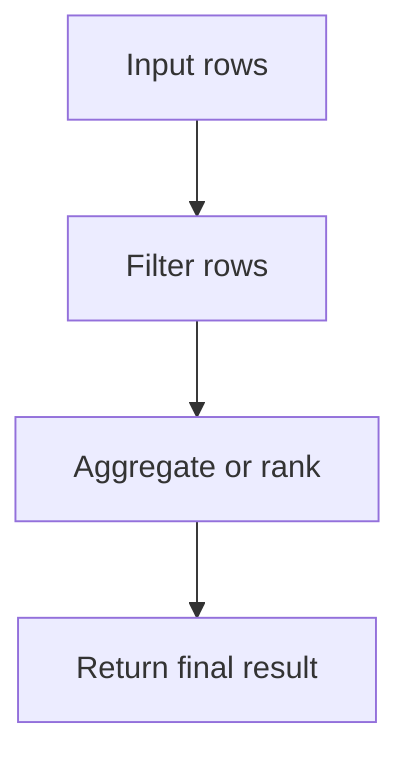

# SQL 풀이 글 작성 가이드 (SolveSQL / SQL Practice)

SolveSQL 같은 SQL 문제 풀이 글의 **내용 구조와 스타일**을 다루는 작성자용 문서입니다. 파일명·front matter 같은 공통 규칙은 [../guide/03-writing-posts.md](../guide/03-writing-posts.md)에 정의되어 있으니, 여기서는 SQL 풀이 글 특유의 **섹션 구성·쿼리 설명 방식·검증 절차**에 집중합니다.

> 이 문서가 속한 `docs/blog_post/`와 `docs/guide/`는 [_config.yml](../../_config.yml)의 `exclude`에 포함되어 Jekyll 빌드에서 제외됩니다. 즉 게시되지 않는 **작성자용 내부 문서**입니다.

> **언어 정책**: 모든 **블로그 글**([_posts/*.md](../../_posts/))은 **영어**로 씁니다. 작성자용 문서(`docs/guide`, `docs/blog_post`)만 한국어입니다. 따라서 SQL 풀이 글의 본문·표·쿼리 설명은 전부 영어입니다.

## 언제 이 유형을 쓰는가

- SolveSQL, SQLZoo, 데이터베이스 연습 문제처럼 **SQL 쿼리 자체가 풀이**인 글.
- LeetCode/BOJ처럼 알고리즘 구현을 설명하는 글이 아니라, 문제 조건을 `SELECT`, `WHERE`, `GROUP BY`, window function 등으로 번역하는 과정을 보여줄 때.
- 한 문제의 최종 제출 쿼리와 재사용 가능한 SQL 패턴을 함께 기록할 때.

## 섹션 구조 (핵심 흐름 + 문제별 가감)

SQL 글은 아래 **핵심 흐름**을 공통으로 따르되, 모든 문제에 같은 섹션을 억지로 넣지 않습니다. 간단한 `SELECT` 문제는 짧게 쓰고, CTE/window function/집계 문제가 나오면 `Strategy`, `Clause-by-Clause`, `Pitfalls`를 더 자세히 씁니다. 모든 본문 헤더는 `## `(H2)에서 시작하고, 단일 `#`은 쓰지 않으며, 섹션 사이는 `---`(수평선)로 구분합니다.

| 섹션 (H2) | 필수? | 목적 |
| --- | --- | --- |
| `## Problem` | 필수 | 문제 요약 + 원문 링크(`>` 인용). 원문 전문은 복사하지 않음 |
| `## Data Model` | 권장 | 사용 테이블·컬럼·의미를 표로 정리 |
| `## Query Goal` | 필수 | 문제 조건을 SQL 작업 단위로 재해석 |
| `## Expected Result / Result Schema` | 권장 | 출력 컬럼·별칭·행 단위·동점/정렬 기대값 명시 |
| `## Strategy` | 필수 | 선택한 SQL 패턴과 쿼리 분해 방식 설명 |
| `## Step-by-Step Analysis` | 권장 | CTE/필터/집계/window 흐름을 작은 단계로 추적 |
| `## Solution` | 필수 | 최종 제출 SQL (` ```sql ``` ` 블록) |
| `## Clause-by-Clause` | 권장 | 주요 SQL 절이 맡는 역할 설명 |
| `## Pitfalls` | 권장 | NULL, 정렬, 집계 전후 필터, window 필터링, 동점 처리 |
| `## Key Takeaways` | 선택 | 재사용 가능한 SQL 패턴 요약 표 |

### 문제 유형별 권장 조합

- **기본 조회·상수 반환**: `Problem → Query Goal → Solution → Key Takeaways`. 예: literal `SELECT`.
- **필터링·정렬**: `Problem → Data Model → Query Goal → Solution → Clause-by-Clause → Pitfalls`.
- **집계 문제**: `Problem → Data Model → Query Goal → Expected Result → Strategy → Solution → Clause-by-Clause → Pitfalls`.
- **CTE/window function 문제**: `Problem → Data Model → Query Goal → Expected Result → Strategy → Step-by-Step Analysis → Solution → Clause-by-Clause → Pitfalls → Key Takeaways`.

각 섹션의 작성 요령은 다음과 같습니다.

- **Problem**: 맨 위에 `>` 인용으로 원문 링크를 둡니다. 문제 전문·데이터셋 설명을 복사하지 말고, 필요한 요구사항만 1~2문단으로 요약합니다.
- **Data Model**: 실제 쿼리에서 사용한 테이블과 컬럼만 씁니다. 모든 스키마를 옮기지 않습니다.
- **Query Goal**: 자연어 조건을 SQL 절로 번역합니다. 예: "returned transactions must not count" → `WHERE is_returned = 0` before aggregation.
- **Expected Result / Result Schema**: 출력 컬럼, 별칭, 행 단위를 확인합니다. SQL 문제에서는 알고리즘 글의 샘플 출력 검증에 해당하는 핵심 섹션입니다.
- **Strategy**: `Top per Group`, `Aggregate Threshold`, `Previous Row Comparison`처럼 재사용 가능한 패턴 이름을 붙입니다.
- **Step-by-Step Analysis**: CTE가 여러 개라면 각 CTE의 입력과 출력을 한 줄씩 적고, 필요하면 `flowchart TD`로 흐름을 그립니다.
- **Solution**: 최종 제출 쿼리만 싣습니다. 실험용 쿼리나 임시 주석은 제거합니다.
- **Clause-by-Clause**: `WHERE`가 집계 전에 적용되는지, `HAVING`이 집계 후 적용되는지, window function을 어느 쿼리 단계에서 계산하는지 설명합니다.
- **Pitfalls**: 틀리기 쉬운 지점을 명시합니다. 특히 window function 결과는 같은 `SELECT`의 `WHERE`에서 바로 필터링하지 못하므로 CTE나 바깥 쿼리에서 거릅니다.

---

## 제목과 front matter 규칙

front matter `title`은 **영어**로, SolveSQL 글은 아래 형식을 지킵니다.

| 출처 | 제목 형식 | 예시 |
| --- | --- | --- |
| SolveSQL | `[SolveSQL] <English Problem Title>` | `[SolveSQL] VIP of Cities` |

```yaml
---
title: "[SolveSQL] VIP of Cities"
date: 2026-06-14 00:00:00 +0900
categories: [SQL, SolveSQL]
tags: [SQL, SolveSQL, CTE, Window Function, RANK, GROUP BY, Top per Group]
description: "Solution for SolveSQL VIP of Cities using CTEs and window ranking."
image:
  path: assets/img/posts/algo/solvesql.png
  alt: "[SolveSQL] VIP of Cities"
author: seoultech
mermaid: true
---
```

- `categories`: `[SQL, SolveSQL]`로 통일합니다. SQL을 독립 학습 축으로 관리합니다.
- `tags`: SQL 문법(`GROUP BY`, `RANK`)과 패턴명(`Top per Group`)을 함께 넣습니다.
- `image.path`: 공용 대표 이미지 `assets/img/posts/algo/solvesql.png`를 재사용합니다. 맨 앞 `/`는 붙이지 않습니다.
- `math`: LaTeX 수식이 실제로 있을 때만 넣습니다. SQL 글에는 보통 생략합니다.
- `mermaid`: 본문에 실제 ` ```mermaid ``` ` 블록이 있을 때만 `true`로 둡니다.

---

## SQL 코드 스타일

SolveSQL 풀이 쿼리는 SQLite 실행 환경을 기준으로 작성합니다. 세부 규칙은 solvesql 레포의 `docs/reference/sql-style.md`를 따릅니다.

- SQL 절은 대문자로 씁니다: `SELECT`, `FROM`, `WHERE`, `GROUP BY`, `HAVING`, `ORDER BY`.
- 선택 컬럼이 둘 이상이면 각 컬럼을 한 줄씩 씁니다.
- CTE와 중첩 표현식은 2-space indentation을 사용합니다.
- 의미 있는 중간 결과에는 CTE 이름을 붙입니다.
- 행 단위 필터는 `WHERE`, 집계 결과 필터는 `HAVING`에 둡니다.
- window function 결과 필터는 CTE나 바깥 쿼리의 `WHERE`에서 처리합니다.
- 출력 순서가 문제 요구사항이거나 결과 검증에 중요하면 `ORDER BY`를 명시합니다.
- `SELECT *`는 문제에서 전체 행을 요구할 때만 씁니다.

---

## SQL 패턴 이름 붙이기

`## Strategy`와 `## Key Takeaways`에서는 문제를 아래처럼 패턴으로 부릅니다. 패턴명은 solvesql 레포의 `docs/explanation/sql-patterns.md`와 맞춥니다.

| Pattern | When to Use |
| --- | --- |
| `Literal Result` | 상수 하나를 반환할 때 |
| `Text Contains Match` | 대소문자 무관 부분 문자열 검색 |
| `Date Range Filter` | 날짜/시간 범위를 필터링할 때 |
| `Conditional Bucketing` | `CASE`로 구간을 만든 뒤 집계할 때 |
| `Aggregate Threshold` | 집계값 기준으로 그룹을 거를 때 |
| `Top per Group` | 그룹별 최고 행을 뽑을 때 |
| `Previous Row Comparison` | 이전 행과 비교할 때 |
| `Baseline Comparison` | 전체/부분 평균 같은 기준값과 비교할 때 |
| `Non-null Result Rows` | 완전한 행만 반환해야 할 때 |

---

## 검증 (게시 전 필수)

SQL 글에서 가장 흔한 실수는 **결과 스키마·정렬·필터 위치**가 문제 요구사항과 어긋나는 것입니다. 게시 전 아래를 반드시 확인합니다.

1. **최종 SQL 일치**: 글의 `## Solution` 코드블록이 제출한 `.sql` 파일과 의미상 동일한지 확인합니다.

   ```bash
   diff -u /path/to/submitted.sql /tmp/extracted-from-post.sql
   ```

2. **결과 스키마 확인**: 출력 컬럼명·별칭·컬럼 순서가 문제 요구와 같은지 확인합니다. 예: `city_id`, `customer_id`, `total_spent`.

3. **정렬 확인**: 결과 순서가 요구되거나 검증에 중요하면 `ORDER BY`를 명시합니다. SQL은 `ORDER BY`가 없으면 행 순서를 보장하지 않습니다.

4. **필터 위치 확인**:
   - 행 단위 필터 → `WHERE`
   - `GROUP BY` 집계 결과 필터 → `HAVING`
   - window function 결과 필터 → CTE 또는 바깥 쿼리의 `WHERE`

5. **집계 전후 순서 확인**: 반품 제외, NULL 제외처럼 집계 대상 자체를 바꾸는 조건은 집계 전에 적용해야 합니다.

6. **동점 처리 확인**: `RANK`, `DENSE_RANK`, `ROW_NUMBER` 중 선택한 함수가 문제의 tie requirement와 맞는지 확인합니다.

7. **다이어그램과 쿼리 흐름 일치**: Mermaid 흐름도가 실제 CTE 순서와 다르면 안 됩니다.

8. **H1 없음 확인**: 본문에 단일 `#`(H1)이 없는지 확인합니다.

   ```bash
   grep -nE '^# [^#]' _posts/<파일>.md
   ```

---

## 영어 복붙 템플릿

새 SQL 풀이 글은 아래 골격을 [_posts/](../../_posts/)에 복사해 채웁니다. 본문은 **영어**로 작성합니다. Mermaid 다이어그램을 쓰지 않으면 front matter의 `mermaid: true`를 제거합니다.

````markdown
---
title: "[SolveSQL] <Problem Title>"
date: YYYY-MM-DD 00:00:00 +0900
categories: [SQL, SolveSQL]
tags: [SQL, SolveSQL, <Pattern>, <Clause or Function>]
description: "Solution for SolveSQL <Problem Title>."
image:
  path: assets/img/posts/algo/solvesql.png
  alt: "[SolveSQL] <Problem Title>"
author: seoultech
mermaid: true
---

## Problem

> [SolveSQL <Problem Title>](https://solvesql.com/problems/<slug>/)

<One or two sentence problem summary. Do not copy the full problem statement.>

---

## Data Model

| Table | Columns Used | Meaning |
| --- | --- | --- |
| `<table>` | `<column>` | <What this column means in the query> |

---

## Query Goal

Translate the problem into SQL steps:

1. <Filter or normalize input rows.>
2. <Aggregate, rank, or join.>
3. <Return the required result columns.>

---

## Expected Result / Result Schema

| Column | Meaning |
| --- | --- |
| `<column>` | <Expected meaning> |

<State the row granularity and any tie behavior.>

---

## Strategy

This is a **<Pattern Name>** problem.

<Explain why this pattern fits.>

---

## Step-by-Step Analysis



1. <Step 1>
2. <Step 2>
3. <Step 3>

---

## Solution

```sql
<Final submitted SQL>
```

---

## Clause-by-Clause

### `<clause or CTE>`

<Explain what this part does and why it belongs here.>

---

## Pitfalls

- <Pitfall 1>
- <Pitfall 2>

---

## Key Takeaways

| Point | Description |
| --- | --- |
| `<SQL concept>` | <Reusable lesson> |
````
